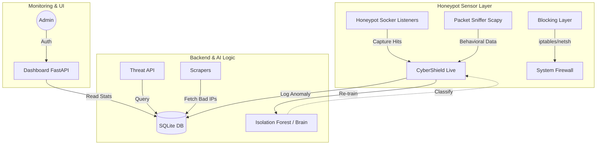

# 🛡️ Cyber Shield AI
### Automated Honeypot, Threat Intelligence & Cybersecurity Dashboard

**Cyber Shield AI** is a comprehensive cybersecurity platform designed to protect infrastructure by proactively attracting, analyzing, and blocking malicious traffic. It combines a behavioral-based honeypot with a sophisticated Threat Intelligence API and a real-time monitoring dashboard.

---

## 🏗️ High-Level Architecture



---

## 🚀 Getting Started

### Prerequisites
- Python 3.10+
- `scapy` (for packet sniffing)
- `pandas`, `numpy`, `scikit-learn` (for AI engine)
- `fastapi`, `uvicorn` (for dashboard and API)
- Windows (for `netsh` blocking) or Linux (for `iptables`)

### Installation
1. **Clone the repository:**
   ```bash
   git clone https://github.com/cyberpolak99/cyber-shield-ai.git
   cd cyber-shield-ai
   ```

2. **Install dependencies:**
   ```bash
   pip install -r requirements.txt
   ```

3. **Configure Environment:**
   ```bash
   cp .env.example .env
   # Edit .env with your secrets
   ```

4. **Run the system:**
   - **Start the monitoring engine (Sensor):**
     ```bash
     python honeypot/cyber_shield_live.py
     ```
   - **Start the Dashboard:**
     ```bash
     python dashboard/dashboard.py
     ```
   - **Start the Threat Intelligence API:**
     ```bash
     python backend/threat_api.py
     ```

---

## ✨ Features

- **Honeypot Sensors**: Multi-port virtual traps (SSH, Telnet, HTTP, SMB) that capture attacker payloads and source behavior.
- **Threat Intelligence API**: A RapidAPI-compatible interface for querying IP reputation and anomaly history. Supports severity filtering and automated blacklisting.
- **AI Brain**: Hybrid detection using Isolation Forest and explained behavioral analysis to catch Zero-Day attacks.
- **Automated Blocking**: Real-time integration with system firewalls to neutralize threats within seconds.
- **Dashboard**: A secured telemetry dashboard for visualizing attacks and active blocks.

---

## 🗺️ Roadmap
- [ ] **Phase 1**: Bulk CSV enrichment for mass IP reputation checking.
- [ ] **Phase 2**: Real-time Slack/Discord alerting for critical anomalies.
- [ ] **Phase 3**: Integration with global threat feeds (AbuseIPDB, OTX).
- [ ] **Phase 4**: Advanced "Morfing" sensor logic to simulate vulnerable IoT devices.

---

## 📄 License
This project is licensed under the **MIT License**. Created for educational and research purposes in cyber security. 🇵🇱
